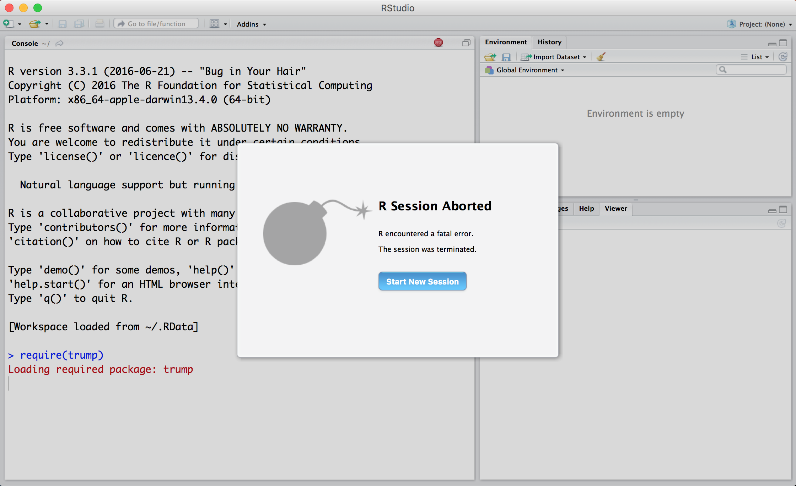

# Instantly segfault your R session

[](https://travis-ci.org/romainfrancois/trump)

```
require(trump)
```

This will instantly segfault your R session. Is that useful, probably not, but so what. 

<iframe src="https://giphy.com/embed/3oKIPx8H70SsclhKkE" width="480" height="266" frameBorder="0" class="giphy-embed" allowFullScreen></iframe><p><a href="https://giphy.com/gifs/trump-r-segfault-3oKIPx8H70SsclhKkE">via GIPHY</a></p>

## Installing 

`trump` probably will never go to CRAN, but then again you never know, in the meantime you can install it from github using 

```
install_github("romainfrancois/trump")
```

## on the console 

```
> library("trump")

 *** caught segfault ***
address 0x50, cause 'memory not mapped'

Traceback:
 1: get("attach")(structure(list(), class = "UserDefinedDatabase"))
 2: fun(libname, pkgname)
 3: doTryCatch(return(expr), name, parentenv, handler)
 4: tryCatchOne(expr, names, parentenv, handlers[[1L]])
 5: tryCatchList(expr, classes, parentenv, handlers)
 6: tryCatch(fun(libname, pkgname), error = identity)
 7: runHook(".onAttach", ns, dirname(nspath), nsname)
 8: attachNamespace(ns, pos = pos, deps)
 9: doTryCatch(return(expr), name, parentenv, handler)
10: tryCatchOne(expr, names, parentenv, handlers[[1L]])
11: tryCatchList(expr, classes, parentenv, handlers)
12: tryCatch({    attr(package, "LibPath") <- which.lib.loc    ns <- loadNamespace(package, lib.loc)    env <- attachNamespace(ns, pos = pos, deps)}, error = function(e) {    P <- if (!is.null(cc <- conditionCall(e)))         paste(" in", deparse(cc)[1L])    else ""    msg <- gettextf("package or namespace load failed for %s%s:\n %s",         sQuote(package), P, conditionMessage(e))    if (logical.return)         message(paste("Error:", msg), domain = NA)    else stop(msg, call. = FALSE, domain = NA)})
13: library("trump")

Possible actions:
1: abort (with core dump, if enabled)
2: normal R exit
3: exit R without saving workspace
4: exit R saving workspace
5: impeach
Selection:
```
